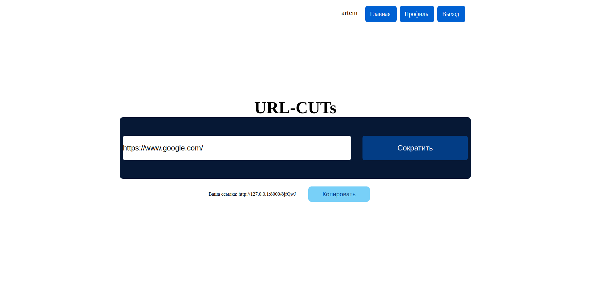
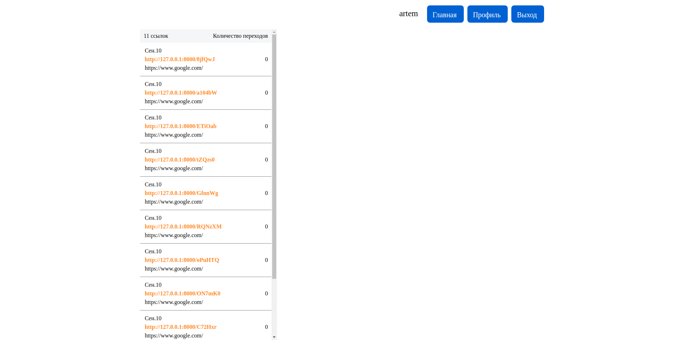
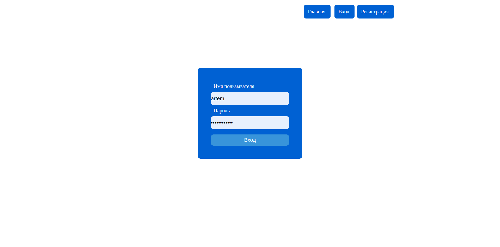
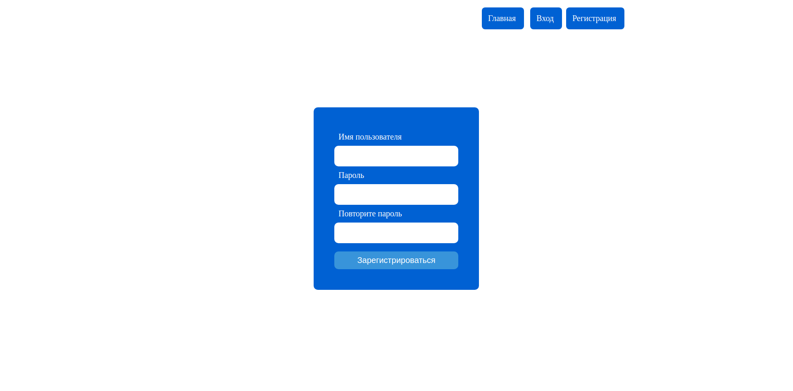

# URLCUTs

This is my fist django project, where i tried to implement the system short url, 
registration, login, systems, profile and another.

## Screenshots 

#### Main Page

#### Profile

#### Login/Register

## Installation

Clone repository  `git clone https://github.com/skiter847/URLCUTs-django.git && cd URLCUTs-django`

Install requirements `pip install -r requirements.txt`

Open terminal and write `python manage.py runserver`
